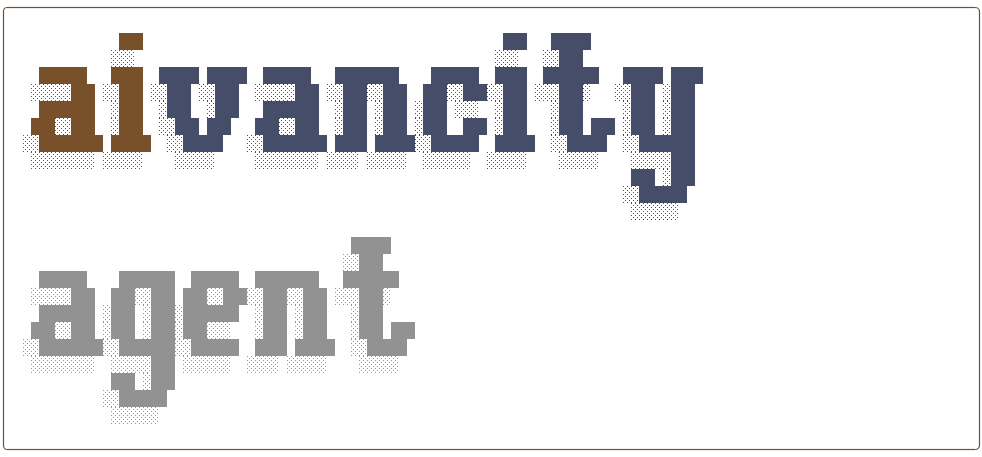

# Lalaby - Your AI French Learning Assistant

**An intelligent French language learning companion with goal tracking and progress monitoring**

Lalaby is an AI-powered command-line assistant that helps you learn French through conversation while tracking your study goals and progress. Built with OpenAI's function calling capabilities, it combines language practice with smart learning analytics.

---

## ✨ Features

### 🎯 Goal Setting & Tracking
- Set weekly French learning goals in hours
- Track your progress throughout the week
- Get visual feedback with emoji status indicators
- Automatic new week detection and reminders

### ⏱️ Time Logging
- Log your study sessions with dates
- View current week's total learning time
- See detailed session breakdowns
- Historical data tracking

### 📊 Progress Monitoring
- Compare goal vs actual time
- See percentage completion
- Get motivational feedback based on progress
- Track days remaining in the week

### 💬 French Conversation
- Practice French with an AI teacher
- Get explanations in English when needed
- Natural conversation practice
- Integrated learning tools

### 🎨 Beautiful Terminal UI
- Rich text formatting with colors and panels
- Syntax-highlighted tool execution
- Smooth loading spinners
- Markdown rendering support

---

## 🚀 Installation

### Step 1: Clone the Repository

```bash
git clone https://github.com/bcivitcioglu/cfa-agent.git
cd cfa-agent
```

### Step 2: Create Virtual Environment

Creating a virtual environment keeps Lalaby's dependencies isolated from your system Python.

**macOS/Linux:**
```bash
python3 -m venv .venv
source .venv/bin/activate
```

**Windows:**
```bash
python -m venv .venv
.venv\Scripts\activate
```

You should see `(.venv)` in your terminal prompt, indicating the virtual environment is active.

### Step 3: Install Dependencies

```bash
pip install -r requirements.txt
```

This installs:
- `openai` - OpenAI API client
- `rich` - Beautiful terminal formatting
- `python-dotenv` - Environment variable management
- `PyYAML` - YAML configuration files
- `pypdf` - PDF reading support
- `pytest` - Testing framework (optional)

### Step 4: Setup API Key

Create a `.env` file in the project directory:

```bash
echo "OPENAI_API_KEY=your-api-key-here" > .env
```

**Important:** 
- Get your API key from [OpenAI Platform](https://platform.openai.com/api-keys)
- Never commit your `.env` file to version control
- Keep the `.env` file in the project root directory

### Step 5: Run Lalaby

```bash
python main.py
```

That's it! Lalaby should now start up with the welcome banner.

---

## 💻 Usage

### Starting Lalaby

Every time you want to use Lalaby:

```bash
# 1. Navigate to the project directory
cd /path/to/cfa-agent

# 2. Activate the virtual environment
source .venv/bin/activate  # macOS/Linux
# OR
.venv\Scripts\activate     # Windows

# 3. Run Lalaby
python main.py
```

### Deactivating the Virtual Environment

When you're done:

```bash
deactivate
```

### Advanced: Install as Command (Optional)

If you want to run `lalaby` from anywhere without activating the virtual environment:

```bash
# Inside the activated virtual environment
pip install -e .

# Now you can run from anywhere (while venv is active)
lalaby
```

**Note:** This installs Lalaby as a package in your virtual environment and creates the `lalaby` command. This is optional and not required for normal use

---

## 📖 How to Use

### Starting a Session

When you launch Lalaby, you'll see:
- A welcome banner
- Automatic new week detection
- Status of your current learning goal

### Setting Goals

Tell Lalaby to set your weekly goal:
```
You: Set my weekly goal to 5 hours
```

Or in French:
```
You: Je veux étudier 5 heures par semaine
```

### Logging Study Time

Log your learning sessions:
```
You: Log 2 hours of study time
You: I studied for 1.5 hours today
You: Log 3 hours for yesterday
```

### Checking Progress

Ask about your progress:
```
You: Show my progress
You: How am I doing this week?
You: Compare my goal and actual time
```

### French Conversation

Practice French naturally:
```
You: Bonjour! Comment vas-tu?
You: Explique-moi la différence entre "savoir" et "connaître"
You: Aidez-moi à améliorer mon français
```

### Built-in Commands

- `/help` - Show available commands
- `/stats` - View memory statistics
- `/clear` or `/reset` - Clear conversation history
- `/exit` or `/quit` - Exit the application

---

## 🛠️ Available Tools

Lalaby has access to the following tools:

| Tool | Description |
|------|-------------|
| **set_french_learning_goal** | Set or update weekly learning goal (hours) |
| **get_french_learning_goal** | View current goal and last update time |
| **log_french_learning_time** | Log study sessions with optional date |
| **get_french_learning_time** | Get current week's logged time |
| **compare_french_learning_progress** | Compare goal vs actual with status |
| **check_new_week_status** | Check if a new week started |
| **write_to_file** | Save content to files |
| **get_date** | Get current date |
| **get_batch_newsletter** | Fetch latest AI news |

---

## 🧪 Testing

### Run All Tests

```bash
python -m pytest tests/ -v
```

### Run Specific Test Suites

```bash
# Test core functionality
python -m pytest tests/test_core.py -v

# Test memory management
python -m pytest tests/test_memory.py -v

# Test goal setting
python -m pytest tests/test_learning_goal.py -v

# Test time tracking
python -m pytest tests/test_learning_time.py -v

# Test progress comparison
python -m pytest tests/test_progress_comparison.py -v

# Test week detection
python -m pytest tests/test_week_check.py -v
```

### Test Coverage

The project includes comprehensive tests covering:
- ✅ Tool functionality and schemas
- ✅ Memory management and compression
- ✅ Goal setting and retrieval
- ✅ Time logging and tracking
- ✅ Progress comparison logic
- ✅ Week detection and transitions

---

## 📁 Project Structure

```
cfa-agent/
├── main.py              # CLI interface and chat loop
├── agent.py             # OpenAI API integration and agent logic
├── tools.py             # Tool implementations and schemas
├── memory.py            # Conversation history management
├── config.py            # Configuration and settings
├── prompts.yaml         # System prompts and templates
├── pyproject.toml       # Package configuration
├── requirements.txt     # Python dependencies
├── .env                 # API keys (not in git)
├── memory.json          # Conversation history (auto-generated)
├── stats.json           # Learning data (auto-generated)
└── tests/               # Test suite
    ├── test_core.py
    ├── test_memory.py
    ├── test_learning_goal.py
    ├── test_learning_time.py
    ├── test_progress_comparison.py
    └── test_week_check.py
```

---

## ⚙️ Configuration

### Environment Variables

Create a `.env` file:
```bash
OPENAI_API_KEY=your-api-key-here
```

### Memory Settings

In `config.py`:
```python
MEMORY_THRESHOLD_KB = 50    # Trigger summarization at 50KB
MEMORY_KEEP_LAST_N = 10     # Keep last 10 messages after summarization
OPENAI_MODEL = "gpt-5-nano" # OpenAI model to use
```

### System Prompt

Edit `prompts.yaml` to customize Lalaby's behavior:
```yaml
system_prompt: |
  You are lalaby, a French teacher...
```

---

## 🔧 Development

### Setting Up for Development

```bash
# Clone and create virtual environment
git clone https://github.com/bcivitcioglu/cfa-agent.git
cd cfa-agent
python3 -m venv .venv
source .venv/bin/activate

# Install dependencies (includes pytest)
pip install -r requirements.txt
```

The `requirements.txt` includes:
- `pytest` - Testing framework
- `pytest-cov` - Coverage reporting

### Adding New Tools

1. **Implement the function** in `tools.py`
2. **Add to TOOL_FUNCTIONS** registry
3. **Add to TOOL_SCHEMAS** with JSON schema
4. **Write tests** in appropriate test file

Example:
```python
def my_new_tool(param: str) -> str:
    """Tool description."""
    try:
        # Implementation
        return f"Success: {result}"
    except Exception as e:
        return f"Error: {str(e)}"

# Add to registry
TOOL_FUNCTIONS["my_new_tool"] = my_new_tool

# Add schema
TOOL_SCHEMAS.append({
    "type": "function",
    "function": {
        "name": "my_new_tool",
        "description": "What this tool does",
        "parameters": {
            "type": "object",
            "properties": {
                "param": {
                    "type": "string",
                    "description": "Parameter description"
                }
            },
            "required": ["param"]
        }
    }
})
```

---

## 🐛 Troubleshooting

### "OPENAI_API_KEY environment variable not set"

Make sure:
1. You created the `.env` file in the project root directory
2. The file contains: `OPENAI_API_KEY=your-actual-key`
3. You're running Lalaby from the project directory (where `.env` is located)

### "No module named 'openai'" or other import errors

Make sure you:
1. Activated the virtual environment: `source .venv/bin/activate`
2. Installed dependencies: `pip install -r requirements.txt`

### "(.venv) not showing in terminal"

If the virtual environment isn't activating:
```bash
# macOS/Linux - use source
source .venv/bin/activate

# Windows - use backslashes
.venv\Scripts\activate

# Alternative for Windows PowerShell
.venv\Scripts\Activate.ps1
```

### Virtual Environment Issues

Start fresh:
```bash
# Remove old virtual environment
rm -rf .venv  # macOS/Linux
# OR
rmdir /s .venv  # Windows

# Create new one
python3 -m venv .venv
source .venv/bin/activate
pip install -r requirements.txt
```

### Tests Failing

Make sure you're in the virtual environment:
```bash
source .venv/bin/activate
pip install -r requirements.txt
python -m pytest tests/ -v
```

---

## 📊 Data Storage

### Conversation History

Stored in `memory.json`:
- Automatically saved after each interaction
- Loaded when starting new session
- Compressed when exceeding size threshold
- Backup created as `memory.json.backup`

### Learning Statistics

Stored in `stats.json`:
```json
{
  "weekly_goal_hours": 5.0,
  "goal_updated_at": "2025-10-24T21:17:21.847049",
  "goal_week_start": "2025-10-20",
  "learning_sessions": [
    {
      "date": "2025-10-24",
      "hours": 2.0,
      "logged_at": "2025-10-24T20:51:13.691643"
    }
  ]
}
```

---

## 🤝 Contributing

This project was built for the PGE3-EN Coding for AI course at Aivancity (2025-2026) as a pedagogical demonstration of AI agents with function calling.

### Development Workflow

1. Create a new branch for your feature
2. Make your changes
3. Add tests for new functionality
4. Run the test suite: `pytest tests/ -v`
5. Commit with descriptive messages
6. Submit a pull request

---

## 📄 License

MIT License - See [LICENCE](LICENCE) file for details.

---

## 🙏 Acknowledgments

- Built for Aivancity PGE3-EN Coding for AI course
- Powered by OpenAI's GPT models
- Terminal UI enhanced with [Rich](https://rich.readthedocs.io/)
- Inspired by modern AI agent architectures

---

## 📚 Architecture Overview

### How It Works

```
User Input → Agent → OpenAI API → Tool Selection
                ↓                        ↓
            Memory ← Tool Execution ← Results
                ↓                        ↓
          Response ← OpenAI API ← Tool Results
```

### Key Components

**Agent (`agent.py`)**
- Manages OpenAI API communication
- Handles function calling workflow
- Implements memory compression
- Processes tool execution

**Tools (`tools.py`)**
- 9 available functions
- JSON schemas for LLM
- Execution dispatcher
- Error handling

**Memory (`memory.py`)**
- Conversation persistence
- Size monitoring
- Automatic summarization
- Load/save operations

**Main (`main.py`)**
- CLI interface with Rich UI
- Command handling
- User interaction loop
- Startup checks

---

## 🎓 Educational Note

This project demonstrates:
- **Function Calling** - How LLMs use external tools
- **Memory Management** - Handling conversation context
- **Agent Architecture** - Building autonomous AI systems
- **API Integration** - Working with modern LLM APIs
- **Testing** - Writing reliable AI applications

For a more detailed educational walkthrough, see [CLAUDE.md](CLAUDE.md).

---

**Ready to improve your French? Start with:**
```bash
# Clone and setup
git clone https://github.com/bcivitcioglu/cfa-agent.git
cd cfa-agent

# Create virtual environment
python3 -m venv .venv
source .venv/bin/activate

# Install and configure
pip install -r requirements.txt
echo "OPENAI_API_KEY=your-key" > .env

# Run Lalaby
python main.py
```

Bonne chance! 🇫🇷
