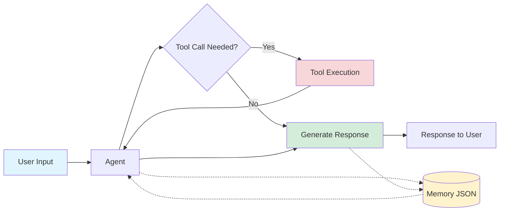

# Simple Agentic CLI Chatbot - Complete Educational Guide

**A pedagogical demonstration of AI agents with function calling using Mistral API**

#### The project is built for PGE3-EN Coding for AI course in aivancity in 2025-2026 Academic Year for pedagogical purposes, with as simple as agentic tool calling can go. The aim is that by reading this README file, you should be able to understand the full codebase and the whole logic. 
---

## Table of Contents

1. [What You'll Learn](#what-youll-learn)
2. [Architecture Overview](#architecture-overview)
3. [Prerequisites](#prerequisites)
4. [Setup Instructions](#setup-instructions)
5. [Code Walkthrough](#code-walkthrough)
6. [Key Concepts Explained](#key-concepts-explained)
7. [Testing](#testing)
8. [How to Extend](#how-to-extend)
9. [Troubleshooting](#troubleshooting)

---

## What You'll Learn

By studying this codebase, you will understand:

1. **AI Agent Architecture** - How to structure an agent system with tools
2. **Function Calling** - How LLMs can decide when and how to use external tools
3. **Memory Management** - How to persist conversations and manage context limits
4. **Context Summarization** - How to compress long conversations to stay within limits
5. **API Integration** - How to work with modern LLM APIs (Mistral)
6. **CLI Design** - How to build interactive command-line applications
7. **Testing** - How to write unit tests for AI systems

---

## Architecture Overview

### High-Level Flow



### File Structure

```
cfa/
├── config.py          # Configuration and settings
├── prompts.yaml       # AI prompts (system prompt, summarization)
├── tools.py           # Tool definitions and execution logic
├── memory.py          # Conversation history management
├── agent.py           # Mistral API integration and agent logic
├── main.py            # CLI interface and chat loop
├── .env               # API keys (not committed to git)
├── memory.json        # Auto-generated conversation history
└── tests/             # Unit tests
    ├── test_core.py
    └── test_memory.py
```

---

## Setup Instructions

### Step 1: Clone or Download the Project

```bash
cd /path/to/your/projects
git clone <your-repo> cfa
cd cfa
```

### Step 2: Create Virtual Environment

```bash
# Create virtual environment
python -m venv .venv

# Activate it
source .venv/bin/activate  # On macOS/Linux
# OR
.venv\Scripts\activate     # On Windows
```

### Step 3: Install Dependencies

```bash
pip -r requirements.txt
```

**What each package does:**
- `mistralai` - Official Mistral AI Python client
- `pytest` - Testing framework
- `python-dotenv` - Loads environment variables from .env file

### Step 4: Set Up API Key

Create a `.env` file in the project root:

```bash
echo "MISTRAL_API_KEY=your-api-key-here" > .env
```

**Security Note:** Never commit `.env` to git! Add it to `.gitignore`.

### Step 5: Run Tests

```bash
python -m pytest tests/ -v
```

You should see all tests pass (18 tests).

### Step 6: Run the Chatbot

```bash
python main.py
```

Try these example interactions:
- "What is today's date?"
- "Write a haiku about Python to haiku.txt"
- "/help" to see commands
- "/exit" to quit

---

## Code Walkthrough

### 1. config.py - Configuration Management

```python
from dotenv import load_dotenv
```
**What it does:** Loads environment variables from `.env` file that is a file we create ourselves, into `os.environ` the environment where we are working. 

```python
PROJECT_DIR = Path(__file__).parent
```
**What it does:** Gets the directory where config.py lives. `__file__` is the path to this file. Try this line directly and see!

```python
MISTRAL_API_KEY = os.getenv("MISTRAL_API_KEY", "")
```
**What it does:** Reads the API key from environment variables. The `""` is the default if not found.

```python
MISTRAL_MODEL = "mistral-large-latest"
```
**Why this model?** Mistral Large supports function calling, which is essential for our agent.

```python
MEMORY_THRESHOLD_KB = 50
MEMORY_KEEP_LAST_N = 10
```
**What these do:**
- When conversation exceeds ```MEMORY_THRESHOLD_KB```, we will trigger summarization
- After summarizing, keep only the last ```MEMORY_KEEP_LAST_N``` messages + summary

**Why?** LLMs have context limits (token limits). We can't send infinite conversation history.

---

### 2. prompts.yaml - AI Prompts

```yaml
system_prompt: |
  You are a helpful AI assistant with access to tools.
  When users ask you to perform tasks that require tools, use them appropriately.
```

**What is a system prompt?** Instructions that define the agent's behavior. This is sent with **every** API call.

**Why YAML?** Easier to edit multi-line prompts than putting them in Python strings. It helps keep our codebase clean, and helps us easily edit prompts as needed. Other than this, there is no reason, we could define them as python strings in our code as well. 

```yaml
summarization_prompt: |
  Please summarize the following conversation history concisely...
```

**When is this used?** When memory exceeds the threshold, we ask the LLM to summarize the conversation using this prompt.

---

### 3. tools.py - Tool Definitions

#### Tool Implementation

```python
def write_to_file(filename: str, content: str) -> str:
    try:
        filepath = Path(filename)
        filepath.write_text(content)
        return f"Successfully wrote to {filename}"
    except Exception as e:
        return f"Error writing to file: {str(e)}"
```

**Key Points:**
- Takes parameters (filename, content)
- Returns a string describing the result
- Handles errors gracefully (no crashes!)
- **The agent will see this return value** This is important. The reason function calls work well is that the agent can see the response whether success or not. So when writing tools, we must be aware that it is not exactly like any other function. All technicality is like any other function, but we need to assume it is for LLMs to read, and this may require some nuances in error messages or success messages. 

#### Tool Schema

```python
TOOL_SCHEMAS = [
    {
        "type": "function",
        "function": {
            "name": "write_to_file",
            "description": "Write content to a file in the current directory",
            "parameters": {
                "type": "object",
                "properties": {
                    "filename": {
                        "type": "string",
                        "description": "The name of the file to write to"
                    },
                    ...
                },
                "required": ["filename", "content"]
            }
        }
    }
]
```

**What is this?** A JSON schema that tells the LLM:
1. What tools are available
2. What each tool does (description)
3. What parameters it needs
4. What type each parameter is

**How does the LLM use this?**
1. User says: "Write a poem to poem.txt"
2. LLM sees `write_to_file` tool description
3. LLM generates a function call: `write_to_file(filename="poem.txt", content="Roses are red...")`
4. Our code executes the tool and returns the result

#### Tool Registry

```python
TOOL_FUNCTIONS: Dict[str, Callable] = {
    "write_to_file": write_to_file,
    "get_date": get_date,
}
```

**What is this?** A dictionary mapping tool names (strings) to actual Python functions.

**Why?** When the LLM says "call write_to_file", we look it up here and execute it.

#### Tool Executor

```python
def execute_tool(tool_name: str, tool_args: Dict[str, Any]) -> str:
    if tool_name not in TOOL_FUNCTIONS:
        return f"Error: Unknown tool '{tool_name}'"

    tool_func = TOOL_FUNCTIONS[tool_name]
    result = tool_func(**tool_args)  # ** unpacks dict into kwargs
    return str(result)
```

**What does `**tool_args` do?** If `tool_args = {"filename": "test.txt", "content": "hello"}`, then `**tool_args` expands to `filename="test.txt", content="hello"`.

---

### 4. memory.py - Conversation History Management

#### Load and Save

```python
def load_memory() -> List[Dict[str, Any]]:
    if not MEMORY_FILE.exists():
        return []

    with open(MEMORY_FILE, 'r') as f:
        return json.load(f)
```

**What's the format?** A list of message dictionaries:
```json
[
  {"role": "user", "content": "Hello"},
  {"role": "assistant", "content": "Hi there!"},
  {"role": "user", "content": "What's the date?"}
]
```

**Why this format?** It's the standard format for chat APIs and easy to parse.

#### Memory Size Calculation

```python
def get_memory_size_kb(messages: List[Dict[str, Any]]) -> float:
    json_str = json.dumps(messages)
    size_bytes = len(json_str.encode('utf-8'))
    return size_bytes / 1024
```

**Why check size?**
1. LLMs have token limits (e.g., 32k tokens)
2. Longer context = slower + more expensive
3. We need to know when to summarize

**Why KB instead of tokens?** Simpler for this demo. In production, you'd count tokens properly.

#### Summarization Logic

```python
def compress_memory(messages: List[Dict[str, Any]], summary: str) -> List[Dict[str, Any]]:
    summary_message = {
        "role": "system",
        "content": f"[Previous conversation summary]: {summary}"
    }

    recent_messages = messages[-MEMORY_KEEP_LAST_N:]
    return [summary_message] + recent_messages
```

**The Strategy:**
1. Old messages (beyond last 10) → Summarize into one message
2. Recent messages (last 10) → Keep verbatim
3. Result: Summary + recent context

**Why keep recent messages?** The last few exchanges have the most relevant context for the current conversation.

---

### 5. agent.py - The Brain of the System

This is the most important file. Let's break it down step by step.

#### Initialization

```python
class Agent:
    def __init__(self):
        if not MISTRAL_API_KEY:
            raise ValueError("MISTRAL_API_KEY environment variable not set")

        self.client = Mistral(api_key=MISTRAL_API_KEY)
        self.model = MISTRAL_MODEL
        self.prompts = load_prompts()
        self.system_prompt = self.prompts["system_prompt"]
```

**What happens here:**
1. Check API key exists (fail fast if not)
2. Create Mistral client
3. Load prompts from YAML
4. Store system prompt for later use

#### The Main Processing Loop

```python
def process_message(self, messages: List[Dict[str, Any]], user_input: str) -> tuple[List[Dict[str, Any]], str]:
```

**Signature breakdown:**
- **Input:** Current messages + new user input
- **Output:** Updated messages + assistant's response
- **Why return both?** So we can save updated messages and display the response

**Step 1: Add user message**
```python
messages.append({"role": "user", "content": user_input})
```

**Step 2: Check if summarization needed**
```python
if should_summarize(messages):
    print("[Memory threshold reached, summarizing conversation...]")
    messages = self._summarize_and_compress(messages)
```

**Step 3: Call Mistral API**
```python
api_messages = [{"role": "system", "content": self.system_prompt}] + messages

response = self.client.chat.complete(
    model=self.model,
    messages=api_messages,
    tools=TOOL_SCHEMAS,
)
```

**Why prepend system_prompt?** The system message should come first to set the agent's behavior.

**What does `tools=TOOL_SCHEMAS` do?** Tells Mistral "here are the tools you can use".

**Step 4: Handle Tool Calls**

This is where the magic happens!

```python
if assistant_message.tool_calls:
    # Add assistant message with tool calls
    messages.append({
        "role": "assistant",
        "content": assistant_message.content or "",
        "tool_calls": [...]
    })
```

**The tool call flow:**

1. **LLM decides to use a tool** - Instead of text, it returns a structured tool call
2. **We execute the tool** - Run the actual Python function
3. **We add tool result to messages** - So the LLM can see what happened
4. **We call the API again** - LLM now generates a response based on tool results

**Example conversation:**

```
User: "What's today's date and write it to date.txt"

→ API Call 1:
  Assistant decides: tool_calls=[
    {name: "get_date", args: {}},
    {name: "write_to_file", args: {filename: "date.txt", content: "<date>"}}
  ]

→ We execute tools:
  Tool results: ["Friday, October 03, 2025", "Successfully wrote to date.txt"]

→ API Call 2 (with tool results):
  Assistant: "I got today's date (Friday, October 03, 2025) and wrote it to date.txt."
```

**Step 5: Return Results**

```python
messages.append({"role": "assistant", "content": final_message.content})
return messages, final_message.content
```

#### Summarization Method

```python
def _summarize_and_compress(self, messages: List[Dict[str, Any]]) -> List[Dict[str, Any]]:
    summary_prompt = create_summary_request(messages, self.prompts["summarization_prompt"])

    summary_response = self.client.chat.complete(
        model=self.model,
        messages=[{"role": "user", "content": summary_prompt}]
    )

    summary = summary_response.choices[0].message.content
    return compress_memory(messages, summary)
```

**What's happening:**
1. Format all messages into a summary request
2. Ask the LLM to summarize
3. Replace old messages with the summary

**Why this works:** LLMs are good at summarization! We use the AI to manage its own context.

---

### 6. main.py - The User Interface

#### The Chat Loop

```python
while True:
    user_input = input("You: ").strip()

    if not user_input:
        continue  # Ignore empty input
```

**Basic pattern:** Infinite loop that reads user input.

#### Command Handling

```python
if user_input.startswith("/"):
    command = user_input.lower()

    if command in ["/exit", "/quit"]:
        save_memory(messages)
        break
```

**Why save on exit?** Preserve conversation history for next session.

#### Message Processing

```python
try:
    messages, response = agent.process_message(messages, user_input)
    print(f"\nAssistant: {response}\n")
    save_memory(messages)
except Exception as e:
    print(f"\nError processing message: {e}\n")
    # Continue the loop even if there's an error
```

**Error handling:** If something goes wrong, print error but don't crash. User can continue chatting.

#### Graceful Shutdown

```python
except KeyboardInterrupt:  # Ctrl+C
    print("\n\nInterrupted. Saving conversation...")
    save_memory(messages)
    print("Goodbye!")
    break
```

**User experience:** Even if user force-quits, we save their conversation.

---

## Key Concepts Explained

### What is Function Calling?

**Traditional LLM:**
```
User: "What's 2+2?"
LLM: "2+2 equals 4"
```

**Problem:** LLM can only generate text. Can't actually perform actions.

**With Function Calling:**
```
User: "Calculate 2+2"
LLM: [tool_call: calculate(expression="2+2")]
System: [executes calculator] → "4"
LLM: "The result is 4"
```

**The LLM can:**
1. Recognize when a tool is needed
2. Generate structured function calls
3. Use tool results in its response

### How Does the Agent Decide to Use Tools?

The LLM is trained to recognize when tools are needed. When we provide tool schemas, it learns:

1. **Tool Description** - "Write content to a file"
2. **User Intent** - "Write a poem to poem.txt"
3. **Decision** - "I should use write_to_file tool"

The system prompt also guides this: "When users ask you to perform tasks that require tools, use them appropriately."

### Why JSON for Messages?

The message format is standardized across AI APIs:

```json
{
  "role": "user" | "assistant" | "system" | "tool",
  "content": "message text",
  "tool_calls": [...]  // optional
}
```

**Benefits:**
- Compatible with multiple AI providers
- Easy to serialize/deserialize
- Self-documenting structure

### Context Window and Memory

**The Problem:**
- LLMs have token limits (e.g., 32k tokens)
- Long conversations exceed this limit
- Can't just keep adding messages forever

**Our Solution:**
1. Monitor conversation size
2. When threshold reached, summarize old messages
3. Keep recent messages + summary
4. This "sliding window" maintains context indefinitely

**Alternative Approaches:**
- Vector databases (semantic search for relevant context)
- RAG (Retrieval Augmented Generation)
- Multiple agents with specialized contexts

---

## Testing

### Running Tests

```bash
# Run all tests
python -m pytest tests/ -v

# Run specific test file
python -m pytest tests/test_core.py -v

# Run specific test
python -m pytest tests/test_core.py::test_get_date -v
```

### Understanding the Tests

**tests/test_core.py** - Tests for config and tools
```python
def test_get_date():
    from tools import get_date
    date_str = get_date()
    assert isinstance(date_str, str)
    assert str(datetime.now().year) in date_str
```

**What this tests:**
1. Function returns a string
2. String contains current year
3. No crashes

**tests/test_memory.py** - Tests for memory management
```python
def test_should_summarize():
    small_messages = [{"role": "user", "content": "Hi"}]
    assert not should_summarize(small_messages)

    large_content = "x" * 60000
    large_messages = [{"role": "user", "content": large_content}]
    assert should_summarize(large_messages)
```

**What this tests:**
1. Small messages don't trigger summarization
2. Large messages do trigger summarization
3. Threshold logic works correctly

### Writing Your Own Tests

When adding a new tool, write tests like this:

```python
def test_my_new_tool():
    from tools import my_new_tool

    # Test normal case
    result = my_new_tool(arg1="test")
    assert "expected" in result

    # Test error case
    result = my_new_tool(arg1="")
    assert "Error" in result
```

---

## How to Extend

### Adding a New Tool

**Step 1: Implement the function** (tools.py)

```python
def read_file(filename: str) -> str:
    """Read content from a file."""
    try:
        filepath = Path(filename)
        if not filepath.exists():
            return f"Error: File {filename} not found"
        return filepath.read_text()
    except Exception as e:
        return f"Error reading file: {str(e)}"
```

**Step 2: Add to tool registry** (tools.py)

```python
TOOL_FUNCTIONS = {
    "write_to_file": write_to_file,
    "get_date": get_date,
    "read_file": read_file,  # Add here
}
```

**Step 3: Add tool schema** (tools.py)

```python
{
    "type": "function",
    "function": {
        "name": "read_file",
        "description": "Read content from a file in the current directory",
        "parameters": {
            "type": "object",
            "properties": {
                "filename": {
                    "type": "string",
                    "description": "The name of the file to read"
                }
            },
            "required": ["filename"]
        }
    }
}
```

**Step 4: Test it**

```bash
python main.py
# You: "Read the contents of README.md"
# Assistant: [reads and shows content]
```

### Modifying the System Prompt

Edit `prompts.yaml`:

```yaml
system_prompt: |
  You are a helpful coding assistant specialized in Python.
  When users ask you to perform tasks that require tools, use them appropriately.
  Always explain what you're doing and why.
```

The agent's behavior will change immediately (no code changes needed!).

### Changing Memory Thresholds

Edit `config.py`:

```python
MEMORY_THRESHOLD_KB = 100  # Increase threshold
MEMORY_KEEP_LAST_N = 20    # Keep more recent messages
```

### Adding More Models

```python
# config.py
MISTRAL_MODEL = "mistral-small-latest"  # Faster, cheaper
# OR
MISTRAL_MODEL = "mistral-large-latest"  # More capable
```
---

## Next Steps

### To Learn More:

1. **Experiment with Prompts** - How do different prompts change behavior?
2. **Add Complex Tools** - Try API calls, database access, etc.
3. **Add Streaming** - Show responses as they're generated
4. **Better interface** - Can we make the whole CLI look better and nicer like other CLI tools? 
---

## Conclusion

You now have a complete understanding of how agentic AI systems work! This simple implementation demonstrates all the core concepts:

✅ **Tool/Function Calling** - LLMs that take actions
✅ **Memory Management** - Handling conversation history
✅ **Context Compression** - Staying within token limits
✅ **Error Handling** - Robust production patterns
✅ **Testing** - Ensuring reliability

**Remember:** The best way to learn is by building. Modify this code, break things, fix them, and add your own features. You can begin simply by adding your own tools, more complicated tools that uses API calls or even other LLM calls. 

---
