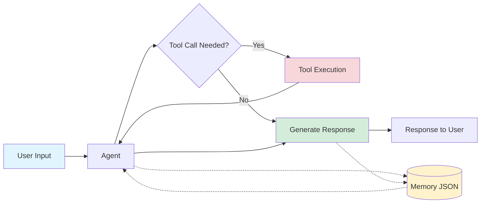

# Simple Agentic CLI Chatbot - Complete Educational Guide

**A pedagogical demonstration of AI agents with function calling using Mistral API**

#### The project is built for PGE3-EN Coding for AI course in aivancity in 2025-2026 Academic Year for pedagogical purposes, with as simple as agentic tool calling can go. The aim is that by reading this README file, you should be able to understand the full codebase and the whole logic.

> 🚀 **Phase 3**: Building on the Rich TUI from Phase 2, this version adds production-ready enhancements:
> - **Rate Limiting**: Respects Mistral API free tier limits (1 request/second)
> - **Multi-Round Tool Calling**: Agent can chain multiple tool operations seamlessly

---

## Table of Contents

1. [What You'll Learn](#what-youll-learn)
2. [Architecture Overview](#architecture-overview)
3. [Prerequisites](#prerequisites)
4. [Setup Instructions](#setup-instructions)
5. [Code Walkthrough](#code-walkthrough)
6. [Key Concepts Explained](#key-concepts-explained)
7. [Testing](#testing)
8. [How to Extend](#how-to-extend)
9. [Troubleshooting](#troubleshooting)

---

## What You'll Learn

By studying this codebase, you will understand:

1. **AI Agent Architecture** - How to structure an agent system with tools
2. **Function Calling** - How LLMs can decide when and how to use external tools
3. **Memory Management** - How to persist conversations and manage context limits
4. **Context Summarization** - How to compress long conversations to stay within limits
5. **API Integration** - How to work with modern LLM APIs (Mistral)
6. **CLI Design** - How to build interactive command-line applications
7. **Testing** - How to write unit tests for AI systems
8. **Rich TUI** - How to create beautiful terminal interfaces with Rich library
9. **Rate Limiting** - How to handle API rate limits gracefully
10. **Multi-Round Tool Calling** - How to enable agents to chain tool operations
---

## Architecture Overview

### High-Level Flow



### File Structure

```
cfa/
├── config.py          # Configuration and settings
├── prompts.yaml       # AI prompts (system prompt, summarization)
├── tools.py           # Tool definitions and execution logic
├── memory.py          # Conversation history management
├── agent.py           # Mistral API integration and agent logic
├── main.py            # CLI interface and chat loop
├── .env               # API keys (not committed to git)
├── memory.json        # Auto-generated conversation history
└── tests/             # Unit tests
    ├── test_core.py
    └── test_memory.py
```

---

## Setup Instructions

### Step 1: Clone or Download the Project

```bash
cd /path/to/your/projects
git clone https://github.com/bcivitcioglu/cfa-agent.git cfa
cd cfa
```

### Step 2: Create Virtual Environment

```bash
# Create virtual environment
python -m venv .venv

# Activate it
source .venv/bin/activate  # On macOS/Linux
# OR
.venv\Scripts\activate     # On Windows
```

### Step 3: Install Dependencies

```bash
pip install -r requirements.txt
```

**What each package does:**
- `mistralai` - Official Mistral AI Python client
- `pytest` - Testing framework
- `python-dotenv` - Loads environment variables from .env file
- `rich` - Beautiful terminal UI with colors, panels, and formatting
- `requests` - HTTP library for web requests and scraping
- `beautifulsoup4` - HTML parsing for web scraping
- `pyyaml` - YAML configuration file parsing

### Step 4: Set Up API Key

Create a `.env` file in the project root:

```bash
echo "MISTRAL_API_KEY=your-api-key-here" > .env
```

**Security Note:** Never commit `.env` to git! Add it to `.gitignore`.

### Step 5: Run Tests

```bash
python -m pytest tests/ -v
```

You should see all tests pass (18 tests).

### Step 6: Run the Chatbot

```bash
python main.py
```

Try these example interactions:
- "What is today's date?"
- "Write a haiku about Python to haiku.txt"
- "Get the latest AI news from The Batch"
- "List files in the current directory"
- "/help" to see commands
- "/stats" to see memory statistics
- "/exit" to quit

---

## Code Walkthrough

### 1. config.py - Configuration Management

```python
from dotenv import load_dotenv
```
**What it does:** Loads environment variables from `.env` file that is a file we create ourselves, into `os.environ` the environment where we are working. 

```python
PROJECT_DIR = Path(__file__).parent
```
**What it does:** Gets the directory where config.py lives. `__file__` is the path to this file. Try this line directly and see!

```python
MISTRAL_API_KEY = os.getenv("MISTRAL_API_KEY", "")
```
**What it does:** Reads the API key from environment variables. The `""` is the default if not found.

```python
MISTRAL_MODEL = "mistral-small-latest"
```
**Why this model?** Mistral Large supports function calling, which is essential for our agent.

```python
MEMORY_THRESHOLD_KB = 20  # Threshold to trigger summarization
MEMORY_KEEP_LAST_N = 5    # Keep last N messages after summarization
```
**What these do:**
- When conversation exceeds `MEMORY_THRESHOLD_KB`, we will trigger summarization
- After summarizing, keep only the last `MEMORY_KEEP_LAST_N` messages + summary

**Why?** LLMs have context limits (token limits). We can't send infinite conversation history.

```python
MAX_TOOL_ROUNDS = 5  # Maximum number of tool call rounds per user message
```
**What this does:** Prevents infinite loops by limiting how many times the agent can call tools for a single user message. This allows **chaining tool calls** (e.g., first list files, then read a specific file) while preventing runaway execution.

```python
MISTRAL_RATE_LIMIT_RPS = 1.0  # Requests per second
MISTRAL_MIN_DELAY = 1.0 / MISTRAL_RATE_LIMIT_RPS  # Minimum delay between calls
```
**What these do:** Configure rate limiting for Mistral API calls. Free tier allows 1 request per second, so we enforce a minimum 1-second delay between API calls to avoid hitting rate limits.

---

### 2. prompts.yaml - AI Prompts

```yaml
system_prompt: |
  You are a helpful AI assistant with access to tools.
  When users ask you to perform tasks that require tools, use them appropriately.
```

**What is a system prompt?** Instructions that define the agent's behavior. This is sent with **every** API call.

**Why YAML?** Easier to edit multi-line prompts than putting them in Python strings. It helps keep our codebase clean, and helps us easily edit prompts as needed. Other than this, there is no reason, we could define them as python strings in our code as well. 

```yaml
summarization_prompt: |
  Please summarize the following conversation history concisely...
```

**When is this used?** When memory exceeds the threshold, we ask the LLM to summarize the conversation using this prompt.

---

### 3. tools.py - Tool Definitions

The agent has access to **6 tools** in this version:

1. **write_to_file** - Write content to a file
2. **read_file** - Read content from a file
3. **get_date** - Get today's date in readable format
4. **get_batch_newsletter** - Scrape latest AI news from deeplearning.ai's The Batch
5. **list_files** - List files in the current directory
6. **curl_read** - Fetch and return content from a URL

#### Tool Implementation Example

```python
def write_to_file(filename: str, content: str) -> str:
    """Write content to a file."""
    try:
        filepath = Path(filename)
        filepath.write_text(content)
        return f"Successfully wrote to {filename}"
    except Exception as e:
        return f"Error writing to file: {str(e)}"
```

**Key Points:**
- Takes parameters (filename, content)
- Returns a string describing the result
- Handles errors gracefully (no crashes!)
- **The agent will see this return value** - This is important. The reason function calls work well is that the agent can see the response whether success or not. So when writing tools, we must be aware that it is not exactly like any other function. All technicality is like any other function, but we need to assume it is for LLMs to read, and this may require some nuances in error messages or success messages.

#### Web Scraping Tool Example

```python
def get_batch_newsletter() -> str:
    """Scrape the latest AI news headlines from The Batch newsletter."""
    url = "https://www.deeplearning.ai/the-batch/"

    try:
        headers = {'User-Agent': 'Mozilla/5.0 ...'}
        response = requests.get(url, headers=headers, timeout=10)
        response.raise_for_status()

        soup = BeautifulSoup(response.content, 'html.parser')
        articles = soup.find_all(['h2', 'h3', 'h4'], ...)

        # Extract headlines and links...
        return "Latest AI News from The Batch:\n\n" + "\n\n".join(headlines)
    except Exception as e:
        return f"Error fetching newsletter: {str(e)}"
```

**What this demonstrates:**
- Real-world web scraping with requests and BeautifulSoup
- Proper error handling for network requests
- Parsing HTML to extract structured information
- Returning formatted, LLM-readable results 

#### Tool Schema

```python
TOOL_SCHEMAS = [
    {
        "type": "function",
        "function": {
            "name": "write_to_file",
            "description": "Write content to a file in the current directory",
            "parameters": {
                "type": "object",
                "properties": {
                    "filename": {
                        "type": "string",
                        "description": "The name of the file to write to"
                    },
                    ...
                },
                "required": ["filename", "content"]
            }
        }
    }
]
```

**What is this?** A JSON schema that tells the LLM:
1. What tools are available
2. What each tool does (description)
3. What parameters it needs
4. What type each parameter is

**How does the LLM use this?**
1. User says: "Write a poem to poem.txt"
2. LLM sees `write_to_file` tool description
3. LLM generates a function call: `write_to_file(filename="poem.txt", content="Roses are red...")`
4. Our code executes the tool and returns the result

#### Tool Registry

```python
TOOL_FUNCTIONS: Dict[str, Callable] = {
    "write_to_file": write_to_file,
    "read_file": read_file,
    "get_date": get_date,
    "get_batch_newsletter": get_batch_newsletter,
    "list_files": list_files,
    "curl_read": curl_read,
}
```

**What is this?** A dictionary mapping tool names (strings) to actual Python functions.

**Why?** When the LLM says "call write_to_file", we look it up here and execute it.

**Critical:** When adding a new tool, you must update THREE places:
1. The function implementation (e.g., `def my_tool(...)`)
2. The `TOOL_FUNCTIONS` registry (add `"my_tool": my_tool`)
3. The `TOOL_SCHEMAS` array (add the JSON schema)

#### Tool Executor

```python
def execute_tool(tool_name: str, tool_args: Dict[str, Any]) -> str:
    if tool_name not in TOOL_FUNCTIONS:
        return f"Error: Unknown tool '{tool_name}'"

    tool_func = TOOL_FUNCTIONS[tool_name]
    result = tool_func(**tool_args)  # ** unpacks dict into kwargs
    return str(result)
```

**What does `**tool_args` do?** If `tool_args = {"filename": "test.txt", "content": "hello"}`, then `**tool_args` expands to `filename="test.txt", content="hello"`.

---

### 4. memory.py - Conversation History Management

#### Load and Save

```python
def load_memory() -> List[Dict[str, Any]]:
    if not MEMORY_FILE.exists():
        return []

    with open(MEMORY_FILE, 'r') as f:
        return json.load(f)
```

**What's the format?** A list of message dictionaries:
```json
[
  {"role": "user", "content": "Hello"},
  {"role": "assistant", "content": "Hi there!"},
  {"role": "user", "content": "What's the date?"}
]
```

**Why this format?** It's the standard format for chat APIs and easy to parse.

#### Memory Size Calculation

```python
def get_memory_size_kb(messages: List[Dict[str, Any]]) -> float:
    json_str = json.dumps(messages)
    size_bytes = len(json_str.encode('utf-8'))
    return size_bytes / 1024
```

**Why check size?**
1. LLMs have token limits (e.g., 32k tokens)
2. Longer context = slower + more expensive
3. We need to know when to summarize

**Why KB instead of tokens?** Simpler for this demo. In production, you'd count tokens properly.

#### Summarization Logic

```python
def compress_memory(messages: List[Dict[str, Any]], summary: str) -> List[Dict[str, Any]]:
    summary_message = {
        "role": "system",
        "content": f"[Previous conversation summary]: {summary}"
    }

    recent_messages = messages[-MEMORY_KEEP_LAST_N:]
    return [summary_message] + recent_messages
```

**The Strategy:**
1. Old messages (beyond last 10) → Summarize into one message
2. Recent messages (last 10) → Keep verbatim
3. Result: Summary + recent context

**Why keep recent messages?** The last few exchanges have the most relevant context for the current conversation.

---

### 5. agent.py - The Brain of the System

This is the most important file. Let's break it down step by step.

#### Initialization

```python
class Agent:
    def __init__(self, console: Console = None):
        if not MISTRAL_API_KEY:
            raise ValueError("MISTRAL_API_KEY environment variable not set")

        self.client = Mistral(api_key=MISTRAL_API_KEY)
        self.model = MISTRAL_MODEL
        self.prompts = load_prompts()
        self.system_prompt = self.prompts["system_prompt"]
        self.console = console or Console()
        self.last_api_call_time = 0  # Track last API call for rate limiting
```

**What happens here:**
1. Check API key exists (fail fast if not)
2. Create Mistral client
3. Load prompts from YAML
4. Store system prompt for later use
5. Accept optional Rich Console for formatted output (dependency injection)
6. Initialize rate limiting timestamp tracker

#### Rate Limiting Method

```python
def _rate_limit(self):
    """Enforce rate limiting by sleeping if necessary."""
    current_time = time.time()
    time_since_last_call = current_time - self.last_api_call_time

    if time_since_last_call < MISTRAL_MIN_DELAY:
        sleep_time = MISTRAL_MIN_DELAY - time_since_last_call
        time.sleep(sleep_time)

    self.last_api_call_time = time.time()
```

**How this works:**
1. Track the time of the last API call
2. Before each new call, check if enough time has passed
3. If not, sleep for the remaining time
4. Update the timestamp after the call

**Why this matters:** Mistral's free tier allows 1 request per second. Without rate limiting, rapid tool calls would fail with 429 (Too Many Requests) errors. This method ensures we never exceed the limit, providing a smooth user experience.

#### The Main Processing Loop

```python
def process_message(self, messages: List[Dict[str, Any]], user_input: str) -> tuple[List[Dict[str, Any]], str]:
```

**Signature breakdown:**
- **Input:** Current messages + new user input
- **Output:** Updated messages + assistant's response
- **Why return both?** So we can save updated messages and display the response

**Step 1: Add user message**
```python
messages.append({"role": "user", "content": user_input})
```

**Step 2: Check if summarization needed**
```python
if should_summarize(messages):
    print("[Memory threshold reached, summarizing conversation...]")
    messages = self._summarize_and_compress(messages)
```

**Step 3: Call Mistral API**
```python
api_messages = [{"role": "system", "content": self.system_prompt}] + messages

response = self.client.chat.complete(
    model=self.model,
    messages=api_messages,
    tools=TOOL_SCHEMAS,
)
```

**Why prepend system_prompt?** The system message should come first to set the agent's behavior.

**What does `tools=TOOL_SCHEMAS` do?** Tells Mistral "here are the tools you can use".

**Step 4: Multi-Round Tool Calling Loop**

This is where the Phase 3 magic happens! The agent can now make **multiple rounds** of tool calls:

```python
tool_round = 0
while tool_round < MAX_TOOL_ROUNDS:
    # Apply rate limiting before each API call
    self._rate_limit()

    # Call Mistral API with spinner
    with Live(Spinner("dots", text=spinner_text), console=self.console, transient=True):
        response = self.client.chat.complete(
            model=self.model,
            messages=api_messages,
            tools=TOOL_SCHEMAS,
        )

    assistant_message = response.choices[0].message

    if assistant_message.tool_calls:
        tool_round += 1

        # Add assistant message with tool calls
        messages.append({
            "role": "assistant",
            "content": assistant_message.content or "",
            "tool_calls": [...]
        })

        # Execute tools and add results...
        for tool_call in assistant_message.tool_calls:
            result = execute_tool(tool_name, tool_args)
            messages.append({
                "role": "tool",
                "name": tool_name,
                "tool_call_id": tool_call.id,
                "content": result
            })

        # Continue loop - agent can call more tools based on results!
        continue

    else:
        # No tool calls - agent is done, return final response
        return messages, content
```

**The multi-round tool call flow:**

1. **User**: "List the files, then read haiku.txt"
2. **Round 1 - API Call**: Agent decides to call `list_files`
3. **Execute**: We run `list_files()` → returns file list
4. **Round 2 - API Call**: Agent sees the list, decides to call `read_file("haiku.txt")`
5. **Execute**: We run `read_file()` → returns file content
6. **Round 3 - API Call**: Agent sees the content, generates final text response
7. **Done**: No more tool calls, return to user

**Why this is powerful:**
- Agent can **chain operations** based on results
- Example: First check what files exist, then read specific ones
- Example: Get AI news, then write it to a file
- Prevents infinite loops with `MAX_TOOL_ROUNDS` limit

**Rate limiting integration:** Each API call (including tool result processing) respects the 1-second delay, preventing rate limit errors even with multiple rounds.

**Step 5: Return Results**

```python
messages.append({"role": "assistant", "content": final_message.content})
return messages, final_message.content
```

#### Summarization Method

```python
def _summarize_and_compress(self, messages: List[Dict[str, Any]]) -> List[Dict[str, Any]]:
    summary_prompt = create_summary_request(messages, self.prompts["summarization_prompt"])

    summary_response = self.client.chat.complete(
        model=self.model,
        messages=[{"role": "user", "content": summary_prompt}]
    )

    summary = summary_response.choices[0].message.content
    return compress_memory(messages, summary)
```

**What's happening:**
1. Format all messages into a summary request
2. Ask the LLM to summarize
3. Replace old messages with the summary

**Why this works:** LLMs are good at summarization! We use the AI to manage its own context.

---

### 6. main.py - The User Interface

#### The Chat Loop

```python
while True:
    user_input = input("You: ").strip()

    if not user_input:
        continue  # Ignore empty input
```

**Basic pattern:** Infinite loop that reads user input.

#### Command Handling

```python
if user_input.startswith("/"):
    command = user_input.lower()

    if command in ["/exit", "/quit"]:
        save_memory(messages)
        break
```

**Why save on exit?** Preserve conversation history for next session.

#### Message Processing

```python
try:
    messages, response = agent.process_message(messages, user_input)
    print(f"\nAssistant: {response}\n")
    save_memory(messages)
except Exception as e:
    print(f"\nError processing message: {e}\n")
    # Continue the loop even if there's an error
```

**Error handling:** If something goes wrong, print error but don't crash. User can continue chatting.

#### Graceful Shutdown

```python
except KeyboardInterrupt:  # Ctrl+C
    print("\n\nInterrupted. Saving conversation...")
    save_memory(messages)
    print("Goodbye!")
    break
```

**User experience:** Even if user force-quits, we save their conversation.

---

## Key Concepts Explained

### What is Function Calling?

**Traditional LLM:**
```
User: "What's 2+2?"
LLM: "2+2 equals 4"
```

**Problem:** LLM can only generate text. Can't actually perform actions.

**With Function Calling:**
```
User: "Calculate 2+2"
LLM: [tool_call: calculate(expression="2+2")]
System: [executes calculator] → "4"
LLM: "The result is 4"
```

**The LLM can:**
1. Recognize when a tool is needed
2. Generate structured function calls
3. Use tool results in its response

### How Does the Agent Decide to Use Tools?

The LLM is trained to recognize when tools are needed. When we provide tool schemas, it learns:

1. **Tool Description** - "Write content to a file"
2. **User Intent** - "Write a poem to poem.txt"
3. **Decision** - "I should use write_to_file tool"

The system prompt also guides this: "When users ask you to perform tasks that require tools, use them appropriately."

### Why JSON for Messages?

The message format is standardized across AI APIs:

```json
{
  "role": "user" | "assistant" | "system" | "tool",
  "content": "message text",
  "tool_calls": [...]  // optional
}
```

**Benefits:**
- Compatible with multiple AI providers
- Easy to serialize/deserialize
- Self-documenting structure

### Context Window and Memory

**The Problem:**
- LLMs have token limits (e.g., 32k tokens)
- Long conversations exceed this limit
- Can't just keep adding messages forever

**Our Solution:**
1. Monitor conversation size
2. When threshold reached, summarize old messages
3. Keep recent messages + summary
4. This "sliding window" maintains context indefinitely

**Alternative Approaches:**
- Vector databases (semantic search for relevant context)
- RAG (Retrieval Augmented Generation)
- Multiple agents with specialized contexts

---

## Testing

### Running Tests

```bash
# Run all tests
python -m pytest tests/ -v

# Run specific test file
python -m pytest tests/test_core.py -v

# Run specific test
python -m pytest tests/test_core.py::test_get_date -v
```

### Understanding the Tests

**tests/test_core.py** - Tests for config and tools
```python
def test_get_date():
    from tools import get_date
    date_str = get_date()
    assert isinstance(date_str, str)
    assert str(datetime.now().year) in date_str
```

**What this tests:**
1. Function returns a string
2. String contains current year
3. No crashes

**tests/test_memory.py** - Tests for memory management
```python
def test_should_summarize():
    small_messages = [{"role": "user", "content": "Hi"}]
    assert not should_summarize(small_messages)

    large_content = "x" * 60000
    large_messages = [{"role": "user", "content": large_content}]
    assert should_summarize(large_messages)
```

**What this tests:**
1. Small messages don't trigger summarization
2. Large messages do trigger summarization
3. Threshold logic works correctly

### Writing Your Own Tests

When adding a new tool, write tests like this:

```python
def test_my_new_tool():
    from tools import my_new_tool

    # Test normal case
    result = my_new_tool(arg1="test")
    assert "expected" in result

    # Test error case
    result = my_new_tool(arg1="")
    assert "Error" in result
```

---

## How to Extend

### Adding a New Tool

**Step 1: Implement the function** (tools.py)

```python
def read_file(filename: str) -> str:
    """Read content from a file."""
    try:
        filepath = Path(filename)
        if not filepath.exists():
            return f"Error: File {filename} not found"
        return filepath.read_text()
    except Exception as e:
        return f"Error reading file: {str(e)}"
```

**Step 2: Add to tool registry** (tools.py)

```python
TOOL_FUNCTIONS = {
    "write_to_file": write_to_file,
    "get_date": get_date,
    "read_file": read_file,  # Add here
}
```

**Step 3: Add tool schema** (tools.py)

```python
{
    "type": "function",
    "function": {
        "name": "read_file",
        "description": "Read content from a file in the current directory",
        "parameters": {
            "type": "object",
            "properties": {
                "filename": {
                    "type": "string",
                    "description": "The name of the file to read"
                }
            },
            "required": ["filename"]
        }
    }
}
```

**Step 4: Test it**

```bash
python main.py
# You: "Read the contents of README.md"
# Assistant: [reads and shows content]
```

### Modifying the System Prompt

Edit `prompts.yaml`:

```yaml
system_prompt: |
  You are a helpful coding assistant specialized in Python.
  When users ask you to perform tasks that require tools, use them appropriately.
  Always explain what you're doing and why.
```

The agent's behavior will change immediately (no code changes needed!).

### Changing Memory Thresholds

Edit `config.py`:

```python
MEMORY_THRESHOLD_KB = 100  # Increase threshold
MEMORY_KEEP_LAST_N = 20    # Keep more recent messages
```

### Adding More Models

```python
# config.py
MISTRAL_MODEL = "mistral-small-latest"  # Faster, cheaper
```

---

## Phase 3: Production Enhancements - Rate Limiting & Multi-Round Tool Calling

**What's new in Phase 3:**

Building on Phase 2's Rich TUI, Phase 3 adds critical production features:

1. **Rate Limiting** - Gracefully handles API rate limits (1 RPS for free tier)
2. **Multi-Round Tool Calling** - Agent can chain tool operations intelligently
3. **Enhanced Error Handling** - Message rollback on failures, detailed error reporting
4. **More Tools** - Web scraping, URL fetching, file operations, directory listing
5. **Custom Branding** - Aivancity-themed dual-color ASCII art

**Why these matter:**
- **Rate limiting** prevents 429 errors and ensures smooth operation on free tier
- **Multi-round calling** enables complex workflows (e.g., "list files, read one, summarize it")
- **Error handling** maintains conversation state even when things go wrong
- **More tools** demonstrate real-world agent capabilities (web scraping, HTTP requests)

### 7. Rich Integration - Enhanced main.py

#### Setting Up Rich Console

```python
from rich.console import Console
from rich.panel import Panel
from rich.markdown import Markdown
from rich.prompt import Prompt
from rich.theme import Theme
```

**What are these?**
- `Console` - Rich's replacement for `print()`, with color and formatting support
- `Panel` - Creates bordered boxes around content
- `Markdown` - Renders markdown text with formatting
- `Prompt` - Rich's replacement for `input()`, with styling
- `Theme` - Defines consistent colors throughout the app

#### Creating the Console

```python
console = Console(theme=Theme({
    "info": "cyan",
    "success": "green",
    "warning": "yellow",
    "error": "red bold",
    "dim": "dim"
}))
```

**What this does:** Creates a console object with predefined color styles.

**Why?** Instead of hardcoding colors everywhere, we define them once. `console.print("[success]Done![/success]")` will always be green.

#### Welcome Banner

```python
console.print(Panel.fit(
    "[bold cyan]Simple Agentic CLI Chatbot[/bold cyan]\n[dim]Powered by Mistral AI[/dim]",
    border_style="cyan"
))
```

**Before (Phase 1):**
```python
print("=" * 60)
print("  Simple Agentic CLI Chatbot")
print("=" * 60)
```

**What changed:** Panel.fit() creates a box that fits the content, with styled borders. `[bold cyan]` is Rich's markup syntax.

**The markup syntax:** `[style]text[/style]` where style can be colors, bold, italic, dim, etc.

#### User Input with Rich Prompt

```python
user_input = Prompt.ask("[bold cyan]You[/bold cyan]").strip()
```

**Before (Phase 1):**
```python
user_input = input("You: ").strip()
```

**What changed:** `Prompt.ask()` renders the prompt with Rich formatting. The prompt label is colored cyan and bold.

**Why?** Consistent visual hierarchy - user input always looks the same.

#### Displaying User Messages

```python
console.print(Panel(user_input, title="[bold cyan]👤 You[/bold cyan]", border_style="cyan"))
```

**What this does:** Wraps user input in a cyan-bordered panel with a title and emoji.

**Visual result:**
```
╭─ 👤 You ────────────────────╮
│ What's today's date?        │
╰─────────────────────────────╯
```

#### Displaying Assistant Responses

```python
md = Markdown(response)
console.print(Panel(md, title="[bold green]🤖 Assistant[/bold green]", border_style="green"))
```

**Before (Phase 1):**
```python
print(f"\nAssistant: {response}\n")
```

**What changed:**
1. Response is parsed as Markdown (supports **bold**, `code`, lists, etc.)
2. Wrapped in a green panel
3. Emoji in title for visual distinction

**Why Markdown?** LLMs often return formatted text. Rich renders it properly:
- Code blocks get syntax highlighting
- Lists are indented
- Headers are bold

#### Memory Statistics Command

```python
def print_stats(messages):
    size_kb = get_memory_size_kb(messages)
    percentage = (size_kb / MEMORY_THRESHOLD_KB) * 100

    stats_text = f"""
**Message Count:** {len(messages)} messages
**Memory Size:** {size_kb:.2f} KB / {MEMORY_THRESHOLD_KB} KB ({percentage:.1f}%)
**Status:** {'[warning]⚠️  Approaching threshold[/warning]' if size_kb > MEMORY_THRESHOLD_KB * 0.8 else '[success]✓ Healthy[/success]'}
    """
    console.print(Panel(stats_text.strip(), title="[bold cyan]Memory Statistics[/bold cyan]", border_style="cyan"))
```

**What's new:** A `/stats` command that shows memory usage.

**The conditional formatting:** If memory is >80% of threshold, show warning (yellow). Otherwise show success (green).

**Why?** Gives users visibility into the system state. This is called "observability" - making internal state visible.

### 8. Rich Integration - Enhanced agent.py

#### Accepting Console in Constructor

```python
def __init__(self, console: Console = None):
    ...
    self.console = console or Console()
```

**What this does:** Agent accepts an optional Console object. If not provided, creates its own.

**Why?** This is called **dependency injection**. The agent doesn't create its own console - it receives one. This means:
1. Tests can pass a mock console
2. Main.py controls the console configuration
3. Agent doesn't need to know about themes

#### Live Spinner During API Calls

```python
from rich.live import Live
from rich.spinner import Spinner

with Live(Spinner("dots", text="[dim]Thinking...[/dim]"), console=self.console, transient=True):
    response = self.client.chat.complete(...)
```

**What this does:** Shows an animated spinner while waiting for the API.

**The `with` statement:** Python's context manager. The spinner appears when entering the block, disappears when exiting.

**The `transient=True` flag:** Makes the spinner disappear after completion (doesn't clutter the screen).

**Why?** User feedback! Without this, the app seems frozen during API calls. The spinner shows "I'm working on it."

#### Displaying Tool Execution

```python
from rich.syntax import Syntax

args_json = json.dumps(tool_args, indent=2)
syntax = Syntax(args_json, "json", theme="monokai", line_numbers=False)

tool_panel = Panel(
    syntax,
    title=f"[bold yellow]⚙️  Executing: {tool_name}[/bold yellow]",
    border_style="yellow"
)
console.print(tool_panel)
```

**Before (Phase 1):**
```python
print(f"[Executing tool: {tool_name} with args: {tool_args}]")
```

**What changed:**
1. Arguments formatted as pretty-printed JSON
2. JSON gets syntax highlighting (keys in one color, values in another)
3. Wrapped in yellow panel (distinct from user/assistant messages)

**The Syntax object:** Takes code string, language ("json"), and theme. Automatically highlights.

**Why yellow?** Visual hierarchy:
- Cyan = User
- Green = Assistant
- Yellow = Tool/System

#### Displaying Tool Results

```python
result_panel = Panel(
    f"[dim]{result}[/dim]",
    title=f"[bold yellow]✓ Result[/bold yellow]",
    border_style="yellow"
)
console.print(result_panel)
```

**What this does:** Shows tool result in a dimmed (gray) panel.

**Why dimmed?** Tool results are less important than the assistant's final response. Dimming de-emphasizes while still showing the information.

#### Memory Compression Feedback

```python
compressed = compress_memory(messages, summary)
self.console.print(f"[success]✓ Memory compressed: {len(messages)} → {len(compressed)} messages[/success]")
```

**What this does:** After summarization, shows before/after message count.

**Why?** Transparency. User sees exactly what happened (e.g., "150 messages compressed to 11 messages").

### Visual Comparison: Phase 1 vs Phase 2

**Phase 1 (master branch):**
```
You: What's today's date?
[Executing tool: get_date with args: {}]

### Future Enhancements to Explore:

1. **Experiment with Prompts** - How do different system prompts change agent behavior?
2. **Add More Complex Tools** - Try database access, file system navigation, API integrations
3. **Add Streaming** - Show responses token-by-token as they're generated
4. **Improve Rate Limiting** - Implement token bucket algorithm for burst support
5. **Add Tool Validation** - Verify tool arguments before execution
6. **Implement Logging** - Track tool usage, API calls, and errors for debugging
7. **Add Multi-Agent Support** - Create specialized agents for different tasks 
---

## Conclusion

You now have a complete understanding of how **production-ready agentic AI systems** work! This implementation demonstrates:

✅ **Tool/Function Calling** - LLMs that take actions in the real world
✅ **Memory Management** - Handling conversation history with summarization
✅ **Context Compression** - Staying within token limits intelligently
✅ **Rate Limiting** - Graceful API quota management
✅ **Multi-Round Tool Calling** - Chaining operations for complex tasks
✅ **Error Handling** - Robust patterns with rollback capabilities
✅ **Rich TUI** - Beautiful, professional terminal interfaces
✅ **Web Scraping** - Real-world data collection tools
✅ **Testing** - Ensuring reliability with comprehensive test coverage

**Phase Evolution:**
- **Phase 1** (master): Basic agent with simple tools and plain text UI
- **Phase 2** (phase2-rich-tui): Added Rich library for beautiful terminal UI
- **Phase 3** (current): Production enhancements - rate limiting, multi-round tool calls, advanced tools

**Remember:** The best way to learn is by building. Fork and modify this code, break things, fix them, and add your own features. Start by:
1. Adding your own tools (maybe a calculator, weather API, or database query)
2. Experimenting with different system prompts to change agent behavior
3. Adjusting rate limits and memory thresholds to see the impact
4. Building more complex tool chains (e.g., research → summarize → email) 

---
